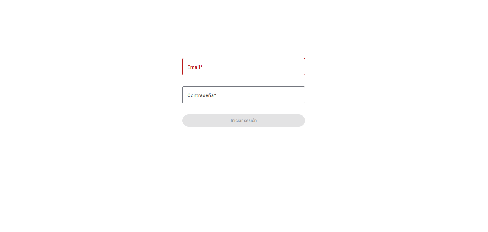
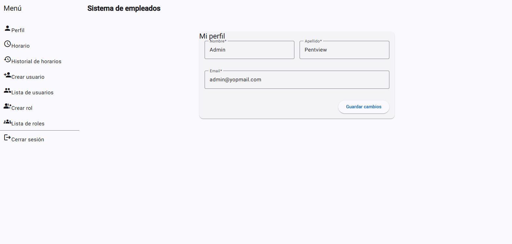
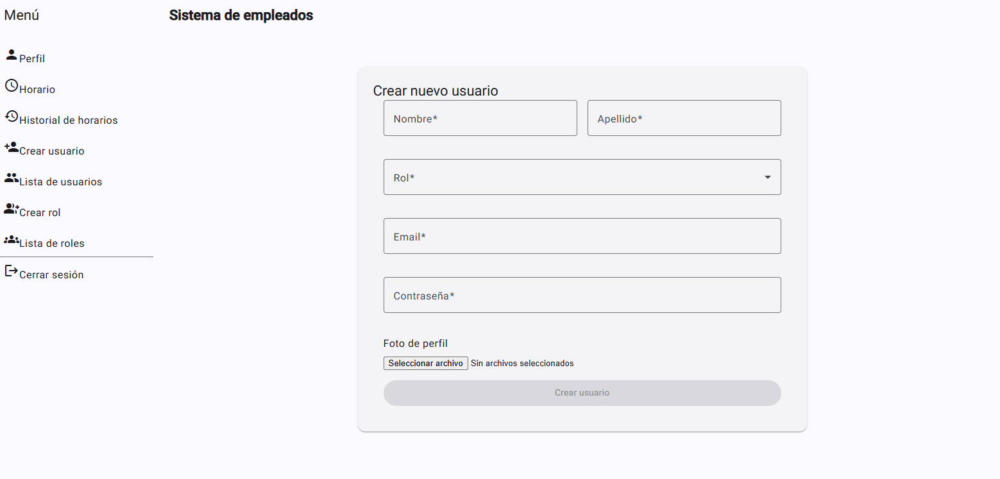
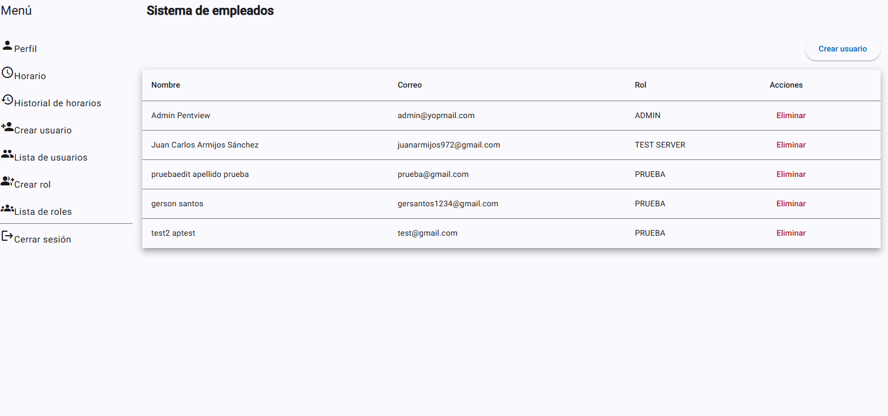

#  Employee Management System (Angular)

Este proyecto es una aplicación de administración de empleados desarrollada como parte de una **prueba técnica**. Permite la gestión de usuarios, roles, horarios laborales y perfiles de forma segura y responsiva.

## 🚀 Tecnologías Utilizadas

- **Angular 18** – Framework principal.
- **Angular Material** – Componentes UI modernos y responsivos.
- **RxJS** – Programación reactiva.
- **JWT** – Autenticación basada en tokens.
- **Guards e Interceptors** – Seguridad de rutas y manejo global de tokens.
- **TypeScript** – Tipado estricto.
- **FormBuilder & Reactive Forms** – Formularios reactivos con validaciones.
- **StandAlone Components** – Arquitectura basada en standlone (users, roles, auth, etc).

---

## 📁 Estructura del Proyecto

src/
├── app/
| ├── components/ # Componente global
│ ├── core/ # Interceptors, guards, servicios globales
│ ├── features/ # Módulos de funcionalidad (auth, users, roles, etc)
│ ├── shared/ # Componentes, layout, utilidades compartidas
│ └── app.routes.ts # Definición principal de rutas


---

## 🧩 Funcionalidades

- ✅ **Login con JWT**
- ✅ **Dashboard responsivo con menú dinámico según el rol**
- ✅ **Gestión de Usuarios:** crear, listar, eliminar.
- ✅ **Gestión de Roles:** crear, listar.
- ✅ **Perfil del usuario actual:** ver y editar.
- ✅ **Registro de horario:** entrada / salida.
- ✅ **Historial de horarios laborales**
- ✅ **Autenticación y autorización por rol (guards)**

---

## 🛠️ Instalación y Ejecución

> ⚠️ Requiere [Node.js] versión 18+ y Angular CLI instalado globalmente.

1. **Clonar el repositorio**
```bash
git clone https://github.com/Gmsantos2/sg-employees.git
cd sg-employees
npm i
ng serve
```

## 🔐 Autenticación
Se utiliza JWT.

El token se almacena en localStorage.
Se inyecta automáticamente en las solicitudes gracias a un HttpInterceptor.

## Pruebas y Consideraciones

Todas las rutas están protegidas por guards (authGuard y roleGuard).
El menú se adapta dinámicamente según el rol (ej: ADMIN ve más opciones).
Validaciones en formularios

#
Capturas de ejecución
Login


Profile desde admin


Creación de usuario 


Lista de usuarios

